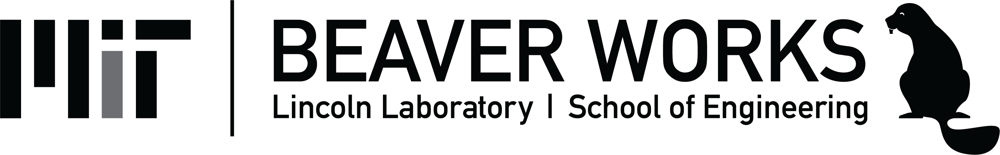

 
 
 

# Welcome!
Hi! [Ayush](https://ayushzenith.tech) here!

This is my documentation for BWSI Racecar 2019...

# Major Credits:

| Name | Link(s) |
| ---- | ---- |
| BWSI | [Click Here](https://beaverworks.ll.mit.edu/CMS/bw/m) |
| Mentor 1 | [No link yet]() |
| Mentor 2 | [No link yet]() |
| Mentor 3 | [No link yet]() |
| Mentor 4 | [No link yet]() |
| Mentor 5 | [No link yet]() |
| Mentor _ | [No link yet]() |
| Mentor _ | [No link yet]() |
| Mentor _ | [No link yet]() |
| Mentor _ | [No link yet]() |

# Important links

| Name | Link |
| ---- | ---- |
| BWSI Dashboard | [Click Here](http://bwsi-dashboard.com) |
| Racecar Slack | [Click Here](https://bwsi19-racecar.slack.com) |
| Racecar Website | [Click Here](http://bwsi-racecar.com) |
