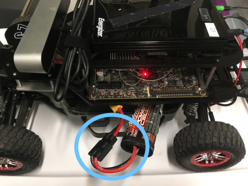

# Car Cheatsheet

## Setting up the car
1. Set the car on a block of some sort, such that the wheels aren't touching the table/ground
2. Unplug the battery charger, and connect the battery into the car (one some cars, there will be two identical wire; you only need to plug in one. On these battery, *quickly* press the battery's power button. If you hold it, it will change the settings. On others, there is a wire marked blue and one marked green, which you must plug into the corresponding ports).

 
3. Turn on the car using the power button on the TX2

4. Plug in the motor battery

 

Your car should look like this:

## SSHing
1. Make sure you're connected to the car's wifi
2. In the Docker terminal, ssh in to the car. You could also ssh in on your native machine if you have a Mac or have an ssh key manager.  
 We know very well this requires much more explanation. If we haven't written instructions by the time we ask you to do this, then you know we've goofed.
3. In the past, we would use the command: `ssh racecar@192.168.1.car_number`. The password is racecar@mit

## Using the Controller
* You must hold down LB to use the controller to drive
* If the Mode light is turned on, press Mode until it turns off
* The controller must be in the X mode (this is changed by a switch in between the bumpers).
* The left joystick controls speed, and the right joystick turns
