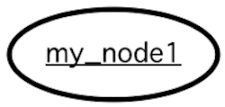
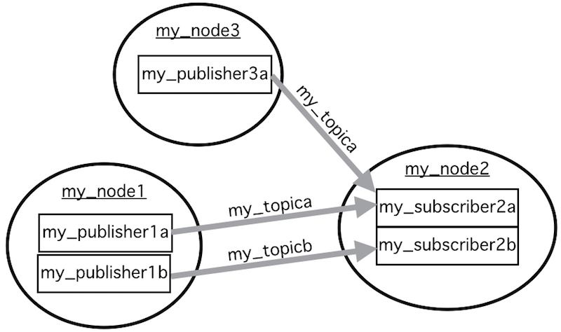
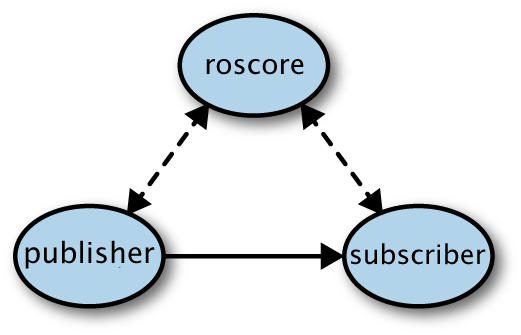

# Robot Operating System (ROS) & rospy

<hr></hr>

## Nodes
*Where do we give the robot its behavior?*



* **A node is a <a href=# data-toggle="tooltip" title="by default in C++ or with rospy, in Python">program</a> that runs on the robot.**
* ROS can run multiple nodes at the same time.<br>
<font color=#A0A0A0 size="2">For example, we give the racecars different nodes for their camera, LIDAR, and driving.</font>
* The nodes can pass <span class="container"> <a href="#" data-toggle="tooltip" title="a node expressed in C++ and a node expressed in Python can send/receive messages between each other">standardized</a> </span>messages between each other.<br>
<font color=#A0A0A0 size="2"> For example, the driving nodes receive messages from the LIDAR and camera nodes. </font>
* Punchline: this allows us to split up the robot's code into logical chunks (instead of having <a href=https://github.mit.edu/2019-BWSI/Writeups/blob/master/ROS/clonkerStateMachine.py title="some of your TA’s old state machine">one clonky program</a>)!  
	* This is the bee's knees for debugging, since one node can fail without causing others to crash.
	* If we switch out a piece of hardware <font color=#A0A0A0>(e.g. if we change the type of LIDAR sensor)</font>, we can just switch out the relevant chunks of software without scrounging through a huge program.

<hr></hr>

## Topics & Messages

*What carries data between nodes?*

### Messages


* **A message is a packet of data.**
* <font color=#00A0F0>To import the message's <a href="#" data-toggle="tooltip" title="You may know of datatypes like String and int, but a class can also work as a custom data type.">datatype</a>:</font>
```python	
from my_source_file import my_msg_class
```
* <font color=#00A0F0>To create a new message:</font>
```python
my_msg = my_msg_class()
```
  This creates an instance of the `my_msg_class` class.

### Topics


* **A topic is a communication channel that carries messages between nodes.** <br>
<font color=#A0A0A0 size="2"> For example, the LIDAR node sends its `LaserScan` messages to the `/scan` topic.</font>
* Each topic can only carry messages of one datatype.
* Multiple nodes can publish to and/or subscribe to one topic.
   
*<a href="http://bwsi-racecar.com/cheatsheets/ros-topics-msgs/">Here</a> is our cheatsheet for topics and message types you will likely use.*

<hr></hr>

## Publishers & Subscribers

*How exactly do nodes send/receive messages from topics?*

### Publishers

* **A publisher is a part of a node that can send messages to a topic.**
* <font color=#00A0F0>To initialize a publisher</font>
```python
my_publisher = rospy.Publisher(my_topic, my_topics_datatype, queue_size=1)
```
where <a href="#" data-toggle="tooltip" title="it refers to how many messages the topic will hold if the topic's subscriber(s) is/are is not receiving the messages as fast as they are published">`queue_size`</a> will be given to you (when in doubt, make it 1).
* <font color=#00A0F0> To send a message</font>
```python
self.my_publisher.publish(my_msg)
```

### Subscribers

* **A subscriber is a part of a node that can receive messages from a topic.**
* <font color=#00A0F0> To initialize a subscriber:</font>
```python
my_subscriber = rospy.Subscriber(my_topic, my_topics_datatype, my_callback_func)
```
where `my_callback_func` is a callback function.

* The callback function's job is to process the received messages. Whenever the subscriber receives a message, it automatically calls the callback function and passes it the message.
* <font color=#00A0F0> A callback function: </font>
```python
def my_callback_func (a_msg_from_my_topic):
  print(a_msg_from_my_topic)
```
<hr></hr>

## Summaries and Related Material



*A mock example graph showing how a set of nodes might connect*


*A graph showing how an actual racecar’s nodes connect*

Command line tricks: see details on our <a href="http://bwsi-racecar.com/cheatsheets/ros/"> ROS Cheatsheet </a>. Some notable commands include:

* To see the connection diagram of nodes and topics, try `rqt_graph`.
* To list all the currently running nodes, try `rosnode list`.
* To list all the topics, try `rostopic list`.

<hr></hr>

## The Details of Connecting and Running Nodes
	
*NOTE: You will not need to know this program your cars (no really; the TA’s were not even aware of this when we first worked on the cars), but it is kinda cool.*

### Connecting Nodes

*The topics connect the nodes… But who builds the topics?*
	


* Hiding under the hood is `roscore`.

1. First `roscore` goes through all the nodes and looks for publishers. If it finds a publisher, it records what node it’s in and what topic it publishes to.  
2. Then `roscore` goes through all the nodes and looks for subscribers. When it finds a subscriber, it checks to see if the subscriber’s topic is in its list of publisher’s topics. If there are publishers that publish to that topic, `roscore` will <a href="#" data-toggle="tooltip" title= "your TA’s actually have no idea what this means computer-wise; we’re just going off of a ROS book we read"> form a direct connection </a> between the publisher(s) and the subscriber.
	


<font color=#A0A0A0>*Taken  with modification by Avalon Vinella from "Programming Robots with ROS" published by O'Reilly Media*</font>

* Since `roscore` forms direct connections between publishers and subscribers, it’s more like a telephone operator (which just connects lines/topics) than a post office (which intercepts all messages and sorts them back out).
* When do we actually run `roscore`? See the last section.

### Running Nodes

* Thanks to the magic of rospy, all it takes to create a node is to run a python file containing 
```python
rospy.init_node("my_node")
```

### Running Nodes in Packages 

* Sometimes it is inconvenient to run `roscore` all your nodes one by one. For convenience then, you can run `roscore` and a whole bunch of nodes automatically with `teleop` or `startZED`; these are simplifications we've made using the car's [.bashrc file](https://github.mit.edu/2019-BWSI/Writeups/tree/master/Bootup%20Bash%20Scripts)

	* (For reference, a bash file contains a set of terminal commands. The .bashrc file in particular automatically runs whenever you open a new terminal. In our case, the robot's main .bashrc file  <a href="#" data-toggle="tooltip" title= "in 3rd from last line in .bashrc, there’s the command: source /home/racecar/.racecars"> runs another bash file called .racecars </a>)  In .racecars, we have written:
```bash
   ...
   # Create aliases to avoid having to type out ros packages and launch files
   alias teleop="roslaunch racecar teleop.launch"
   alias startZED="roslaunch zed_wrapper zed.launch"
   ...
```

* This makes running `teleop` equivalent to running `roslaunch racecar teleop.launch` in the car's terminal.
* `roslaunch` is the actual command we are using. It can run nodes or other files in the package its given, and if `roscore` is not already running, it runs `roscore`.
* `racecar` and `zed_wrapper` are  ROS packages, a collection of files that can include nodes, launch files, or any other relevant files.
* `teleop.launch` and `zed.launch` are the launch files which tell `roslaunch` how to use the files in their respective packages.
