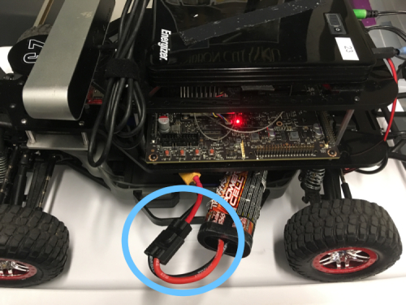

# Week 1 Monday Lab: Setting up and Driving 

Welcome to Racecar! First things first, we need to set up the cars to be able to control them.

## Goals
1. Learn how to set up the car
2. Be able to use ssh
3. Practice controlling the car

## Warning
The Racecar is [$4000 piece of equipment](https://docs.google.com/spreadsheets/d/1Bz5uyDBtgBp4kAXAUPBQpVoT7LoA9LdtpIbnctvofQY/edit?usp=sharing). Treat it with care!

## Setting up the car
1. Set the car on a block on your table, such that the wheels **aren't touching the table**. Unless you're actually testing your code on the ground, leave the car on this block.
2. Unplug the battery charger, and connect the battery to the board. On some cars, there will be two identical wires; you only need to plug one into the battery. On these, *quickly* press the battery's power button. If you hold it, it will change the settings. On other cars, there is a wire marked blue and a wire marked green, which you must plug into the corresponding ports).

3. Turn on the car using the power button on the TX2

The lights should turn green.

4. Plug in the motor battery

Your car should look like this:

### Your Car's IP
The car's IP (which will be used often in connecting to the car) are usually 192.168.1.yourCar'sNumber. When you see an IP in the below instructions, make sure you check it's the right one!

## SSHFS Mounting
In order to access the files on the car, we're going to be using SSHFS to mount its files onto your computer, where you can edit them in VSCode. When you save these files locally, they will automatically get updated on the car! Make sure you're connected to your car's wifi (the password is `g0_fast!`) after downloading the necessary programs and follow these instructions to set it up:

#### Ubuntu
1. In terminal, type `sudo apt-get install sshfs`
2. Create a local directory to store the car's files: `sudo mkdir /path/yourDirectory`. `/path` can be any folder on your computer where you want to mount the car.
3. Then `sudo sshfs -o allow_other racecar@192.168.1.yourCar'sNumber:/home/racecar /path/yourDirectory`. The password is racecar@mit.
4. To make sshfs a little easier, we're going to make an alias so that you won't have to type out that command everytime. In your user home directory, edit your `.bashrc` file. In a new line, add `alias mount="sudo sshfs -o allow_other racecar@192.168.1.yourCar'sNumber:/home/racecar /path/yourDirectory"`. Now anytime you reboot your computer or the car, you can just type `mount` and it will mount your files!

#### Mac OSX
1. Download FUSE and SSHFS [here](https://osxfuse.github.io/)
2. Create a local directory to store the car's files: `sudo mkdir /path/yourDirectory`. `/path` can be any folder on your computer where you want to mount the car.
3. Then `sudo sshfs -o allow_other,defer_permissions racecar@192.168.1.yourCar'sNumber:/home/racecar /path/yourDirectory`. The password is racecar@mit.
4. To make sshfs a little easier, we're going to make an alias so that you won't have to type out that command everytime. In your user home directory, edit your `.bashrc` file. In a new line, add `alias mount="sudo sshfs -o allow_other,defer_permissions racecar@192.168.1.yourCar'sNumber:/home/racecar /path/yourDirectory"`. Now anytime you reboot your computer or the car, you can just type `mount` and it will mount your files!

#### Windows:
1. Install the latest versions of [WinFSP](https://github.com/billziss-gh/winfsp/releases/tag/v1.4.19049) and [win-sshfs](https://github.com/billziss-gh/sshfs-win/releases/tag/v2.7.17334)
2. In file explorer, right click on This PC and choose Map network drive. Choose a local drive to mount, and in the Folder field type `\\sshfs\racecar@192.168.1.yourCar'sNumber`. Check the Connect Using Different Credentials box and connect. The password is racecar@mit.

## SSH'ing
1. Make sure your computer is connected to the car's wifi (it should appear as RACECAR_AP_yourCar'sNumber).
2. In terminal, type `ssh racecar@192.168.1.yourCar'sNumber`. The password is racecar@mit.

Make sure everyone on your team is able to do this before moving on! (You will have to ssh one at a time)

## Controlling the car
Once you've successfully ssh'd in, type `teleop`. This will allow us to actually drive the car. If there is an error about it being unable to connect to the joystick, end the program (ctrl-C) and try again. If there is still an error, as a TA for help. 

Now you can drive the car using the controller! The cars have a Dead Man's Switch for safety; this means that to use the controller to drive, you have to hold down LB at the same time. If the Mode light is turned on, press Mode. The controller must also be in the X mode (this is changed by a switch in between the bumpers). Try driving around! The left joystick controls speed, and the right joystick turns.

Keep in mind that these are expensive piece of equipment; always be aware of your/the car's surroudings when driving, and communicate with other teams that are also driving their cars to avoid damaging them.

When you think you have a good feel of the car, move on to writing the safety controller.
