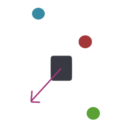

# Week 1 Final Challenge

We've reached your first cumulative challenge! We'll be giving you a more complex racetrack to navigate, and you'll also have a new type of autonomous driving to explore called potential fields.

## How do potential fields work?
Unlike wall following, potential fields takes in all the surrounding LIDAR data to decide how it should move. This means we now have the freedom to drive in any space, with or without walls!

Let's imagine that every piece of LIDAR data has a vector pointing from the car to the point. In order for the car to avoid this obstacle, we want the car to consider this vector in the *opposite* direction so that it will move away from it. So, if it sees something 1 meter in front of it, the car will interpret this as a vector of length 1 meter in the backwards direction. In reality, the car will get a piece of data in every direction; we can then add up all of these vectors to create a final vector that will tell the car what direction it should move in and how fast it should go.


In this diagram, there is also an attracting force (the goal), but we will only be using repelling forces (obstacles). You can just set a default speed and direction to account for this. 

For speed, we have to find a way to adjust for how far away a point is, but we want the opposite effect of proportional control; if an obstacle is closer to the car, we want it to take priority over other, farther away obstacles that we don't need to deal with at the moment. You can tell in the diagram that the vectors closest to the obstacle are larger. 

So if we have LIDAR input and car interpretations like this...


The car should have a final force vector like this:



We can implement this by adjusting each raw distance by some factor such that shorter distances produce much higher speeds and longer distances are slightly slower (think about what mathematical functions would give you a larger output for a smaller input). You also will want to multiple this value by some constant so that we get appropriate speeds for the car.

Think about why we might prefer potential fields over wall following for this racetrack; if there are still walls, how could potential fields work better?

Functions to write:

* `convertPoints`: Convert points to cartesian coordinates

* `calcFinalVector`: Calculate final drive vector

* `drive_callback`: Publish the update speed and angle of the drive vector

Currently, the final vector is of form [speed, angle]. You can change this if you'd like (ie if you want to change it to [x-speed, y-speed])

You can also implement a PID controller to try and make your driving more accurate.

Copy the starter code below into the `wall_follower` starter code file so roslaunch will work correctly (make sure you save your wall follower code somewhere else first!). Then run `roslaunch wall_follower wall_follower.launch` just like yesterday.

```python
#!/usr/bin/env python

import numpy as np
import sys, math, random, copy
import rospy, copy, time
from sensor_msgs.msg import LaserScan
from ackermann_msgs.msg import AckermannDriveStamped

class PotentialField:
	SCAN_TOPIC = rospy.get_param("wall_follower/scan_topic")
	DRIVE_TOPIC = rospy.get_param("wall_follower/drive_topic")

	def __init__(self):
		self.data = None
		self.cmd = AckermannDriveStamped()

		#write your publishers and subscribers here; they should be the same as the wall follower's
		
		#cartesian points -- to be filled (tuples)
		self.cartPoints = [None for x in range(100)]
		
		#[speed, angle]
		self.finalVector = [0.5, 0]

	def scan_callback(self, data):
		'''Checks LIDAR data'''
		self.data = data.ranges
		self.drive_callback()

	def drive_callback(self):
		'''Publishes drive commands'''
		#make sure to publish cmd here

	def convertPoints(self, points):
		'''Convert all current LIDAR data to cartesian coordinates'''

	def calcFinalVector(self, points):
		'''Calculate the final driving speed and angle'''

if __name__ == "__main__":
	rospy.init_node('potential_field')
	potential_field = PotentialField()
	rospy.spin()
```
